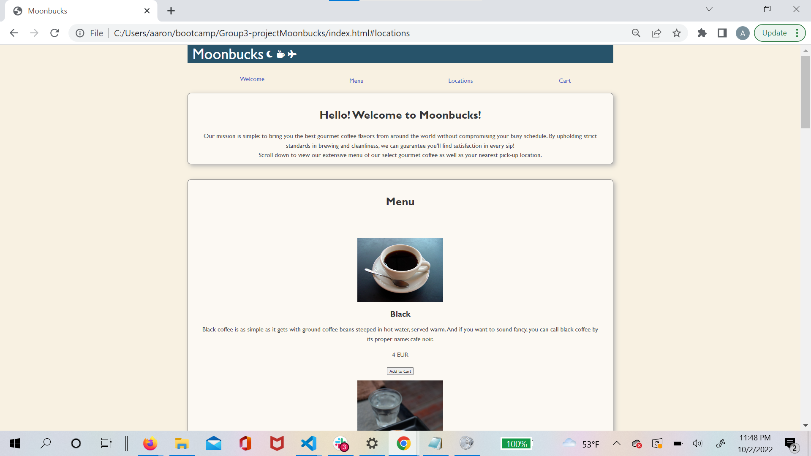

# Project 1: Project Moonbucks

<!-- Repository contains a quality README file with description, screenshot, and link to deployed application.-->

## Description

For our first project my team decided to create a simple ordering site for a international coffee company. The company is imagined to be one that runs their business in major international airports, and thus the user of the site is assumed to be someone who's traveling. Based on this user story we designed a simple ordering system that displays menu items (using a coffee menu API), allows the user to add their choices to their cart (using local storage), and calculates the currency exchange as needed (using a currency converter API).

## Usage
The user can browse the avaliable items and place their order on the site. The signature feature is giving the user the ability to instantly convert to their local currecny. This application is best used for customers who frequently travel.

## Technologies Used

HTML 
CSS 
Javascript 
<a href="https://exchangerate.host/#/docs">Currency Converter API</a> 
<a href="https://sampleapis.com/api-list/coffee">Coffee Menu API</a> 
<a href="https://bulma.io/">CSS Framework: Bulma</a>

## Image

## Link to Deployed Site
https://asantowasso.github.io/Group3-projectMoonbucks/